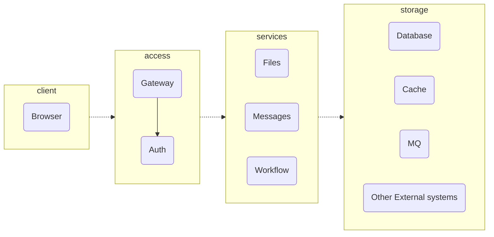
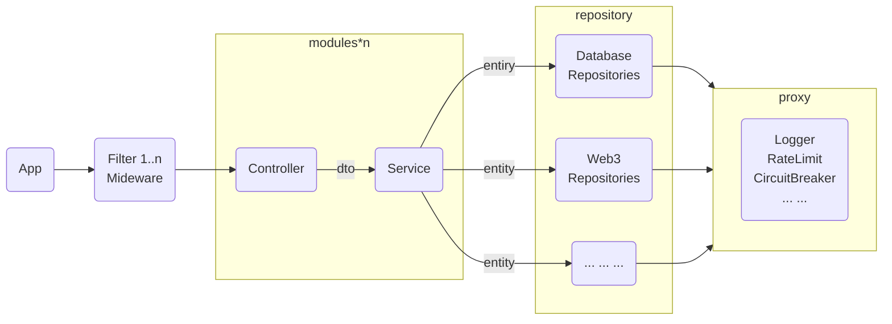

# 通用的系统架构<Badge type="warning" text="Draft" />
  General system architecture
## 概览Overview

## 各部分说明
### Clinet: 客户端
* Browser: 浏览器

### Access: 接入层
* Gateway: 网关
  * 日志
  * 负载均衡
  * 熔断限流
  * 认证/鉴权(通过调用Auth服务实现)
  * 链接池
* Auth: 认证/鉴权 服务
  * 认证服务：登录/登出/修改密码、用户管理
  * 鉴权服务：权限管理、角色管理

### Services: 业务服务
  * Files: 文件服务
  * Messages: 消息服务
  * Workflow: 工作流
  * Scheduling: 分布式任务调度

### Storage: 存储层
  * Database: 数据库
  * Cache: 缓存
  * MQ: 消息队列
  * Other External systems: 其他外部系统

## 业务服务内部结构
### FrontEnd
> TODO

### BackEnd


## 主要处理流程
### 登录
```mermaid
sequenceDiagram
    autonumber
    actor user as User
    participant client as Client<br>Browser
    participant gw as Gateway
    participant auth as Auth
    participant service as Service

    user ->>+client: open
    
    client->>+gw: req: /
    gw ->>+ auth: /api/check
    auth ->>- gw: login requeired
    gw->>-client: redirect: /auth/login

    client ->>+gw: req: /auth/login
    gw ->>+auth: auth/login
    auth  ->>-gw: Login page(HTML)
    gw  ->>-client: Login page(HTML)  

    
    client ->>+user: require usename/pwd
    user ->>-client: input username/pwd
    

    client ->>+gw: req: /auth/api/login
    gw ->>+auth: /auth/api/login
    auth  ->>-gw: Login success(JWT/Cookie)
    gw  ->>-client: Redirect to / (with cookie)

    client ->>+gw: req: /
    gw ->>+service: req:/
    service ->>-gw: home page
    gw ->>-client: home page
    client ->>-user: 
 ```

## 资源
### RUST WEB framework
 https://github.com/flosse/rust-web-framework-comparison?tab=readme-ov-file