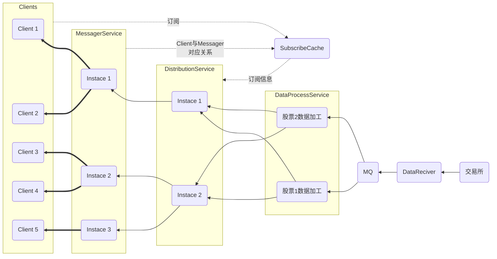

# 股票市场行实时情推送系统

## 概览Overview

* 为了保证数据安全
  * 应该有两个集群来部署上面的服务，保证数据安全。
    > 这样做同时可以分散MessagerServer的压力
## 各个模块说明
* Client: 客户端(通常是PC客户端)
  * 启动与一个Message Service Instance建立长链接
  * 用户选择关注的股票后，发送订阅信息到 SubscribeCache
* DataReciver: 数据接收器
  * 接受到交易所的股票数据
  * 按接受到数据的先后顺序给**数据编号**
  * 按照**股票维度**推送到 MessageQueue
* DataProcessService: 数据加工服务
  * 解析交易所的原始数据
  * 随机发送给一台Distribution Service Instance
  * 行情数据异步落盘
* DistributionService: 分发服务
  * 从SubscribeCache中读取
    * 都有哪些Client订阅了当前股票信息
    * 这些Client都与哪些MessagerService Instance建立的长链接
  * 将数据转发给需要的MessagerService Instance（带上用户ID）
* MessagerService: 消息服务
  * 等待客户端的长链接
  * 收到DistributionService发来的消息后
    根据用户ID找到对应的长链接，推送给客户端
  * 在发送给具体的客户端前会做如下处理
    * **按顺序重新组织数据**:判断与上次发送的数据编号是否连续，如果不连续，暂时缓存起来，等到正确的数据到达后再发送
    * 每次只推送变化的部分

