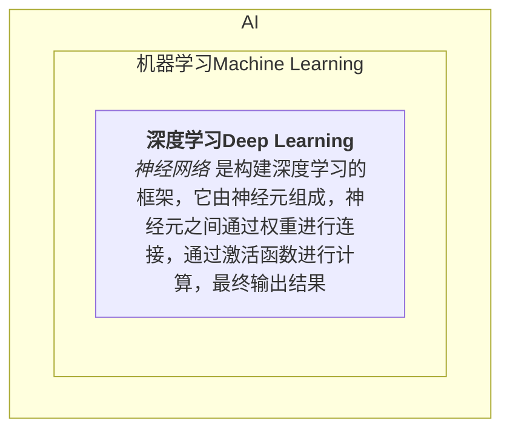

# 神经网络与深度学习

## 神经网络简介
- 什么是神经网络，它与AI、机器学习、深度学习之间的关系
- 神经网络的结构
  - 输入层/隐藏层/输出层
  - 前向传播/反向传播
- 神经网络能做什么
- 学习神经网络需要具备那些知识
  - 一定的数学知识(线性代数 / 概率与信息轮)
  - 学习一个深度学习的开发框架

## 神经网络的学习与预测
- 线性回归
  - 均方误差损失函数
- 逻辑回归
  - 交叉熵损失函数

## 深度神经网络
- 简单的线性代数
- 批量梯度下降
- 矢量化预测与学习过程

## 数字手写体识别
- 前期准备（Rust语言/Candle框架介绍）
- 数据集的划分
- 从零开始实现
- 利用框架实现
- 端到端的学习

## 优化神经网络
- 梯度消失与梯度爆炸
- Regularizing: 正则化
- Normalizing Input: 归一化输入
- 提高学习速度
  - 参数初始化
  - 动量梯度下降
- 减少过拟合
  - 增加数据集
  - Regularizing
  - dropout
- 防止网络退化

## CNN卷积神经网络
- 应用
- 卷积层
- 池化层
- 激活函数
- 图像识别
- 人脸识别
- 物体检测

## RNN循环神经网络
- GRU
- LSTM
- 双向循环神经网络

## LLM 大语言模型
- 词嵌入
- 注意力机制
- Transformer模型
  - Encoder/Decoder
- 从零实现Transformer模型

## GAN

## 模型调优
- 迁移学习