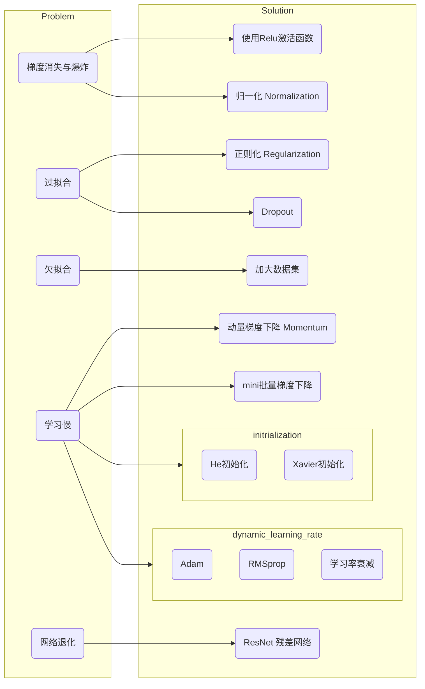

# 优化神经网络<Badge type="warning" text="Draft" />

## 存在的问题与解决方案

### 梯度消失与梯度爆炸
由于计算梯度使用链式法则是连乘的形式，当如果梯度累积太深，当网络深度较深的时候，梯度将以指数的形式传播，最终会导致梯度非常小，网络难以学习或者非常大导致溢出学习失败。
### 过拟合
泛化能力差，在训练集上表现良好，但是泛化能力差，在测试集上表现不好。
### 欠拟合
在训练集和测试集上表现都不好

TODO
.... ... 